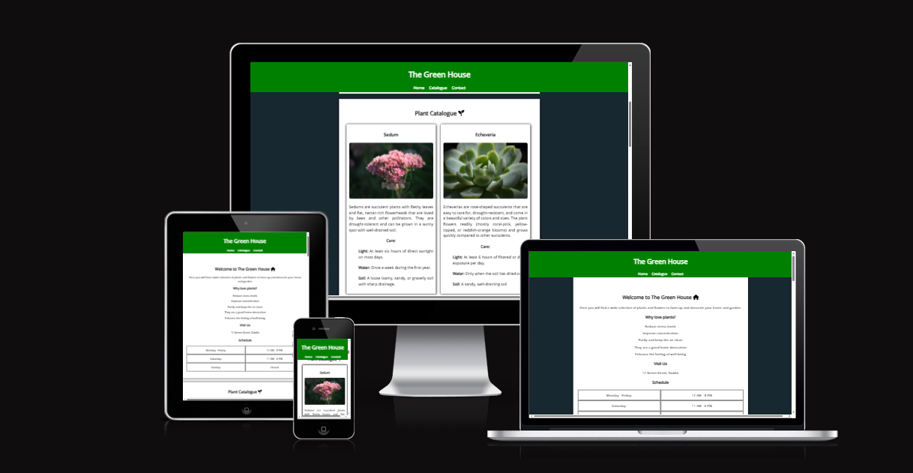
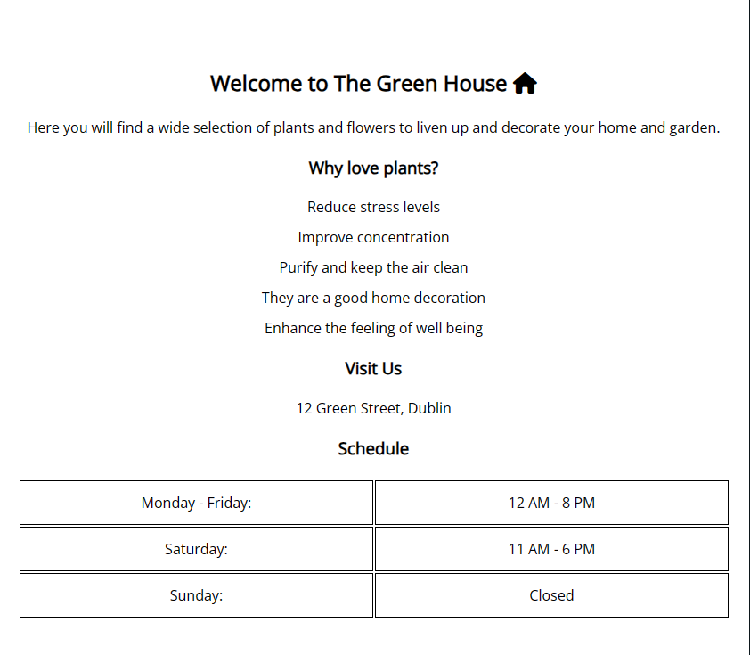
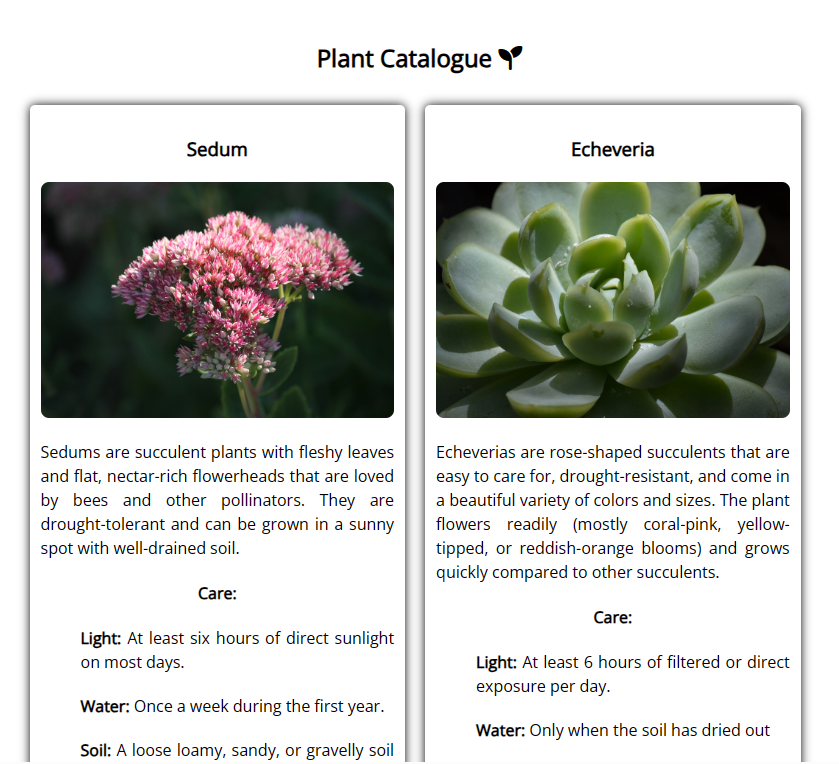
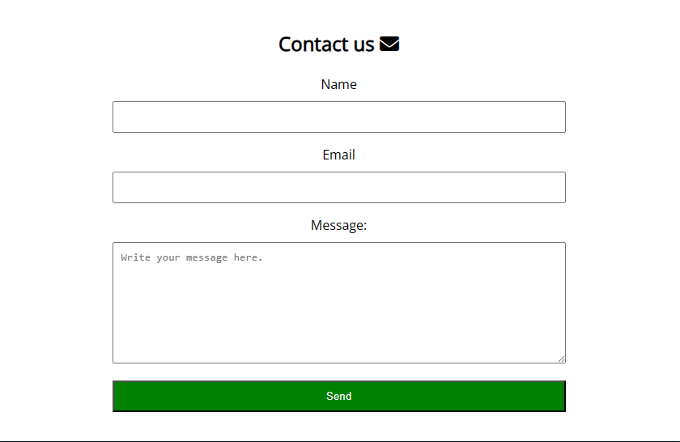
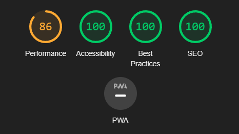

# The Green House
The Green House is a shop that sells plants. The shop offers a wide variety of plants for people who enjoy gardening and nature. 
Visitors will find concise information and instructions about plants. This shop is aimed at plant enthusiasts.

## Features
- Navigation Bar:
    - The navigation bar is easy to use and is fixed.
    - It has links to the three main sections: "Home", "Catalogue" and "Contact".
    - Users will have no problem navigating and finding the information they are looking for.
    

- Home:
    - It has a title and a welcoming paragraph.
    - It has a list citing some benefits of having plants.
    - Provides information about the address and opening hours of the shop.
    

- Catalogue: 
    - Displays a wide variety of plants.
    - Each plant has a concise description and care instructions.
    - It has a responsive design.
    

- Form:
    - Simple design for the user to interact easily.
    - The name, email and message require information to be sent.
    

- Footer: 
    - Display copyright information.
    - Icons instead of text for social networks
    - It has a responsive design on various devices. 
    

### Testing
- I have confirmed that all navigation links work correctly and take the user to the intended sections.
- I have verified that the navigation menu is responsive and accessible on various screen sizes using the devtools device toolbar.
- I have verified that the form allows users to submit information correctly and the submit button works as expected. In addition, the email field has been validated to accept only valid addresses.
- I have checked all the links to make sure they lead to the correct destinations and that they open in a new tab.
- I have tested the website in popular browsers such as Chrome, Firefox, Safari and Edge to ensure compatibility.
- I have checked that the website is responsive and adapts well to different screen sizes using devtools.
- I have confirmed that the images in the catalog section load correctly and are displayed at an optimal size.
- I have confirmed that the header, home, catalog, contact section and footer are readable and easy to understand.

### Validator Testing
- HTML
    - No errors were returned when passing through the official [W3C validator](https://validator.w3.org/nu/?doc=https%3A%2F%2Flsverry.github.io%2FThe-Green-House%2F)
- CSS
    - No errors were found when passing through the official [(Jigsaw) validator](https://jigsaw.w3.org/css-validator/validator)
- Accessibility 
    - I confirmed that the colors and fonts chosen are easy and accessible by running lighthouse in devtools:
    

## Deplyment
- This website was deployed on GitHub pages, here are the steps:
    - In the github repository you have to go to "settings".
    - Scroll down to the pages section and select the branch that contains your code.
    - GitHub Pages will generate a URL for the web page.
  
## Credits

### Content
- Icons for the favicon, sections and footer were taken from [Font Awesome](https://fontawesome.com/)
- The data for the list of reasons were taken from:
    - [Healthline](https://www.healthline.com/)
    - [NBC News](https://www.nbcnews.com/better)
    - [LifeHack](https://www.lifehack.org/)  
- The information for the descriptions and care of the plants was taken from:
    - [Gardeners's World](https://www.gardenersworldmagazine.nl/)
    - [The Spruce](https://www.thespruce.com/) 
    - [Get Busy Gardening](https://getbusygardening.com/)
    - [Snake Plant Care](https://snakeplantcare.com/)
    - [Britannica](https://www.britannica.com/)
    - [Gardening Know How](https://www.gardeningknowhow.com/)
    - [RHS](https://www.rhs.org.uk/)
    - [Hunker](https://www.hunker.com/)

### Media
- The photos used in the catalog were taken from [Pixabay](https://pixabay.com/)